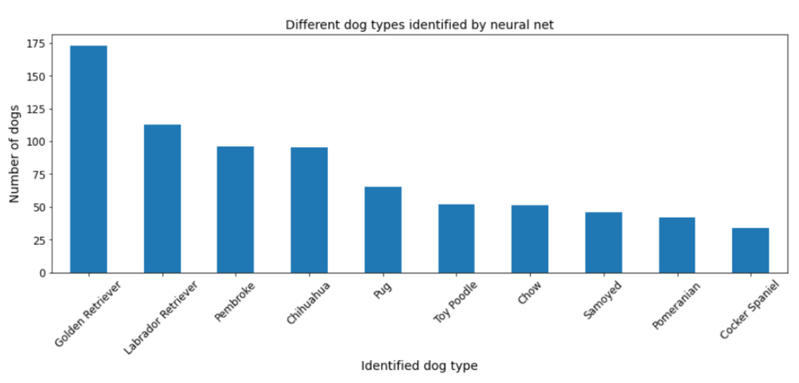
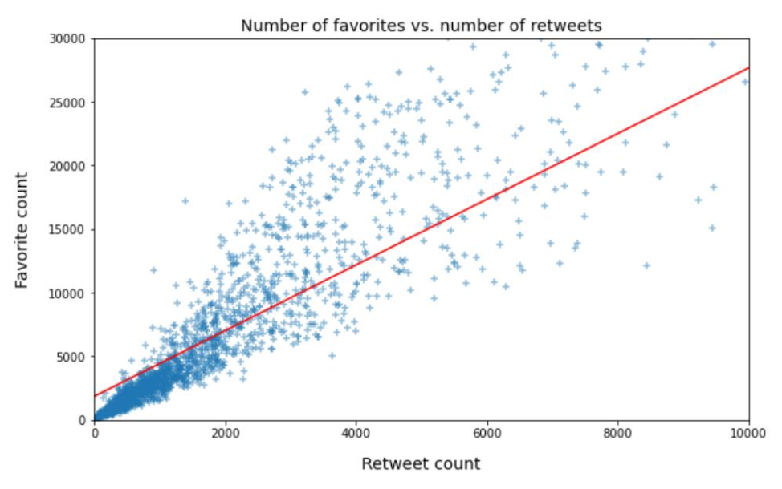
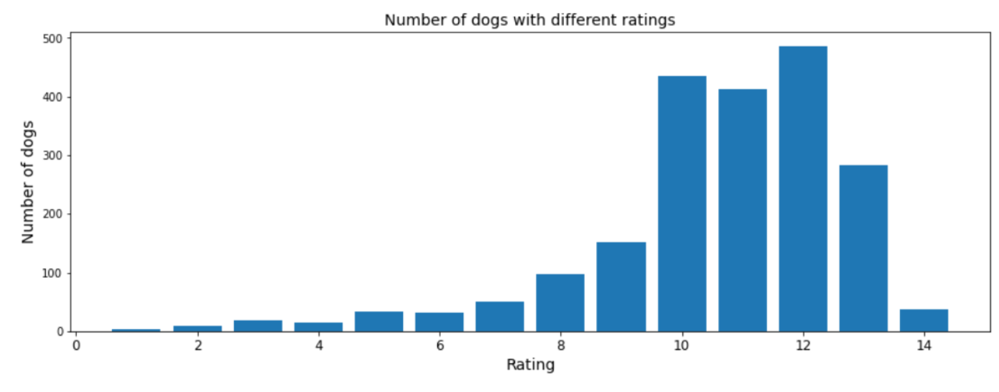

# Data Analysis: WeRateDogs Twitter Archive

We analyzed the record of tweets from the account WeRateDogs® (@dog_rates) to discover some interesting insights about dogs and dog-lovers. We accessed the Twitter archive for WeRateDogs® prior to August 1st, 2017, analyzed those tweets, and ran their associated images through a neural network that classifies the breed of dogs. After cleaning the data, we analyzed tweets for 2069 dogs. Here are our findings.

Please start by reading act_report.pdf (act_report.html).

**Folder contents**

|-**`act_report.pdf`: documentation of analysis and insights into final data**  
|-**`wrangle_report.pdf`: documentation of data wrangling steps: gather, assess, and clean**    
|-**`wrangle_act.ipynb`: code for gathering, assessing, cleaning, analyzing, and visualizing data** 

|- `twitter_archive_enhanced.csv`: file as given    
|- `image_predictions.tsv`: file downloaded programmatically  
|- `tweet_json.txt`: file constructed via API  
|- `twitter_archive_master.csv`: combined and cleaned data  
|- `cleaned_image_predictions.csv`: a database file for your stored clean data  

## Key figures

  

  

  

